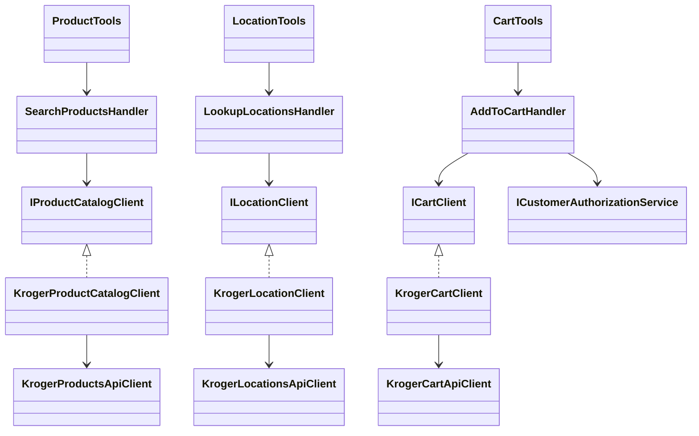
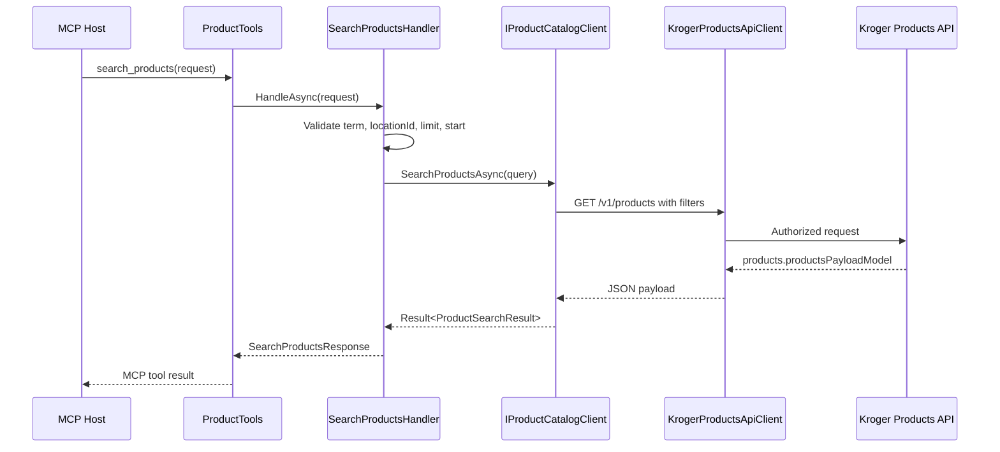
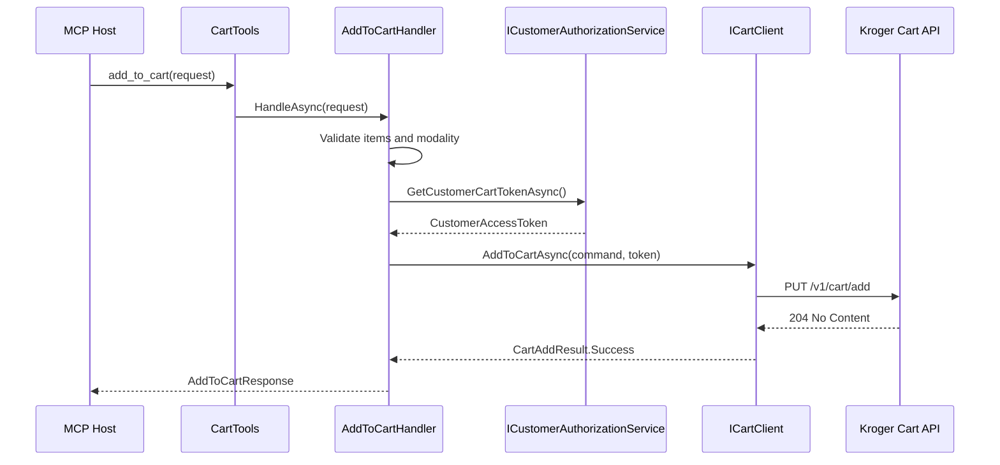

# Kroger MCP Server Detailed Spec

## Summary

Build a greenfield .NET 10 local stdio MCP server for Kroger product search, product details, store/location lookup, and cart additions. Use Onion Architecture, dependency injection, generated-client isolation, and stable MCP root actions that do not expose generated types.

## Public MCP Tool Contracts

- `search_products(SearchProductsRequest request) -> SearchProductsResponse`
- `get_product(GetProductRequest request) -> ProductDetailsResponse`
- `lookup_locations(LookupLocationsRequest request) -> LookupLocationsResponse`
- `get_location(GetLocationRequest request) -> LocationDetailsResponse`
- `add_to_cart(AddToCartRequest request) -> AddToCartResponse`

## Solution Structure

- `src/KrogerMcp.Host`: stdio MCP entrypoint, DI, and tool adapters.
- `src/KrogerMcp.Application`: use cases, stable contracts, validation, and application interfaces.
- `src/KrogerMcp.Domain`: domain records, value objects, result/error model.
- `src/KrogerMcp.Infrastructure.Kroger`: Kroger auth, generated-client wrappers, mapping, options.
- `src/KrogerMcp.Generated.*`: generated-client boundary projects for Products, Cart, and Locations.
- `tests/KrogerMcp.Tests`: validation, handler, mapping, and host smoke tests.

## Application Interfaces

```csharp
public interface IProductCatalogClient {
    Task<Result<ProductSearchResult>> SearchProductsAsync(ProductSearchQuery query, CancellationToken ct);
    Task<Result<Product>> GetProductAsync(ProductId productId, LocationId? locationId, CancellationToken ct);
}

public interface ILocationClient {
    Task<Result<LocationSearchResult>> SearchLocationsAsync(LocationSearchQuery query, CancellationToken ct);
    Task<Result<StoreLocation>> GetLocationAsync(LocationId locationId, CancellationToken ct);
}

public interface ICartClient {
    Task<Result<CartAddResult>> AddToCartAsync(AddToCartCommand command, CustomerAccessToken token, CancellationToken ct);
}

public interface ICustomerAuthorizationService {
    Task<Result<CustomerAccessToken>> GetCustomerCartTokenAsync(CancellationToken ct);
}
```

## Mermaid Architecture



## Mermaid Product Search Flow



## Mermaid Cart Auth Flow



## Validation Rules

- `LocationId`: exactly 8 characters.
- `DepartmentId`: exactly 2 characters.
- Product search `Term`: minimum 3 characters when present.
- Product search `Limit`: 1 to 50.
- Product search `Start`: 1 to 250.
- Location `Limit`: 1 to 200.
- Location `RadiusInMiles`: 1 to 100.
- Product search must include at least one initial search value: `Term` or `Brand` in MCP v1.
- Location search must use exactly one search origin: zip, latLong, lat/lon, or locationId.
- `AddToCartRequest.Items`: non-empty; each quantity must be greater than zero.

## Configuration

```json
{
  "Kroger": {
    "BaseUrl": "https://api.kroger.com",
    "AuthorizationUrl": "https://api.kroger.com/v1/connect/oauth2/authorize",
    "TokenUrl": "https://api.kroger.com/v1/connect/oauth2/token",
    "DefaultLocationId": null,
    "OAuthRedirectUri": "http://127.0.0.1:53682/callback"
  }
}
```

Environment variables: `KROGER_CLIENT_ID`, `KROGER_CLIENT_SECRET`, optional `KROGER_DEFAULT_LOCATION_ID`, optional `KROGER_CUSTOMER_ACCESS_TOKEN`.

## Generation Contract

- Store canonical specs under `openapi/kroger-cart.openapi.json`, `openapi/kroger-products.openapi.json`, and `openapi/kroger-locations.openapi.json`.
- Treat `openapi (2).json` and `openapi (3).json` as duplicate Products specs; keep one.
- Keep stable boundary names: `KrogerProductsApiClient`, `KrogerCartApiClient`, `KrogerLocationsApiClient`.
- Generated projects must not reference Application or Domain.
- Infrastructure may reference Generated projects; Application and Domain may not.
